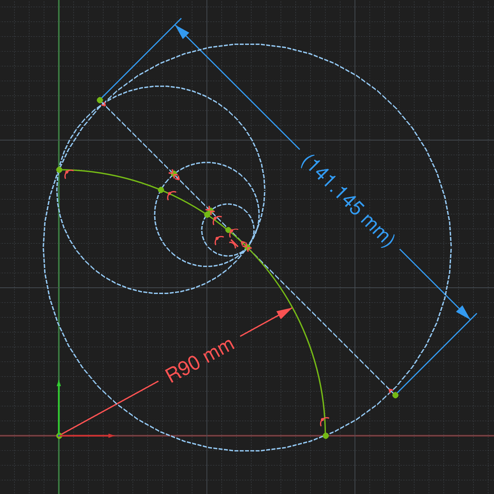
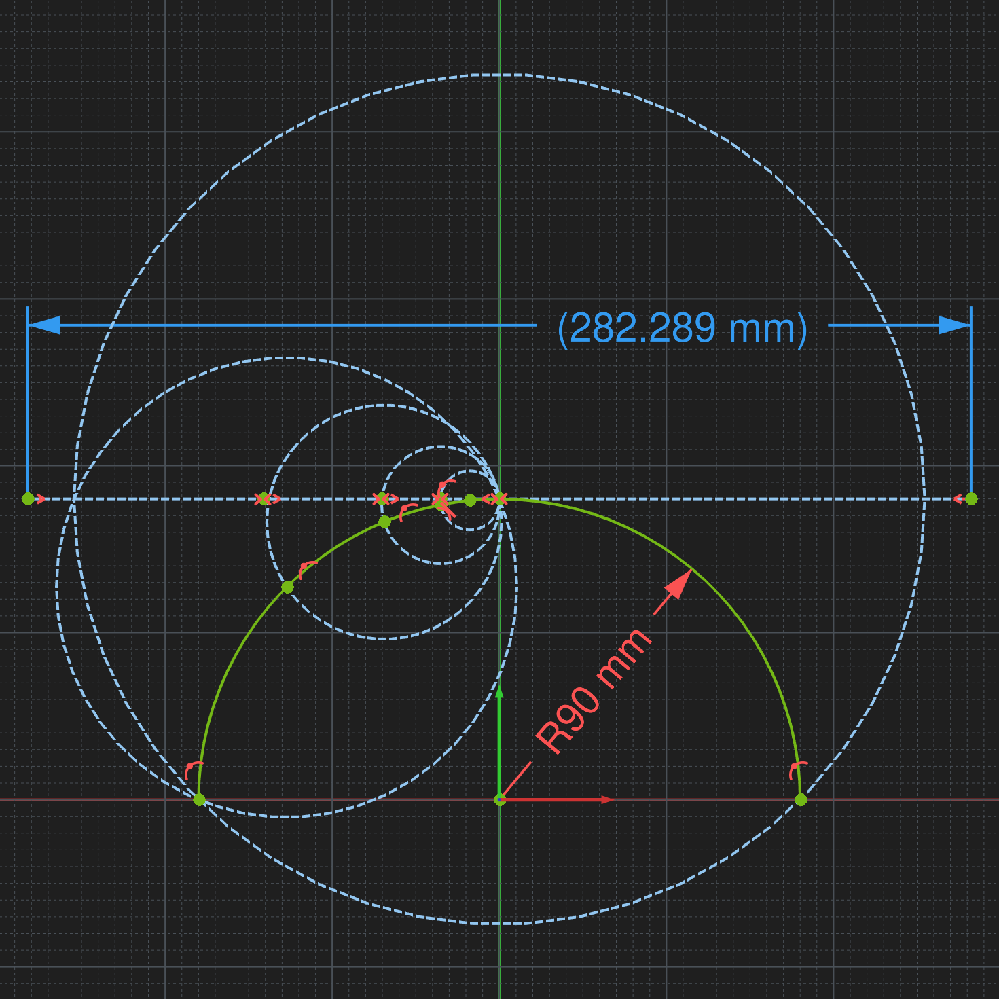

# Circle Arc Constraint Accuracy

A small study of the accuracy of geometric constructions for circular arcs in FreeCAD.

**Or: How to constrain either the radius or the arc length of a circle section.**

For a full circle, the length around the circle is its **circumference**. For only a section of a circle, the corresponding part of the circumference is the **arc length**.

This construction method can therefore be used in both directions:

* constrain the **radius** of a circular arc and determine its resulting **arc length**, or
* constrain the **arc length** and determine the corresponding **radius**.

The tests below compare the accuracy of this approach for different circle sectors and construction methods.

The FreeCAD project file DETERMINE_arc_length.FCStd is included in this repository. Feel free to use, modify, and adapt it for your own projects.

## Accuracy

| Circle sector             | Construction     | Error |
| ------------------------- | ---------------- | ----: |
| up to 90° (¼ circle)      | Center ring only |  2.6% |
| up to 90° (¼ circle)      | 1 ring          | 2.6% |
| up to 90° (¼ circle)      | 2 rings          | 0.65% |
| up to 90° (¼ circle)      | 3 rings          | 0.16% |
||||
| 90°–180° (up to ½ circle) | Center ring only | 11.1% |
| 90°–180° (up to ½ circle) | 1 ring          | 11.1% |
| 90°–180° (up to ½ circle) | 2 rings          | 2.6% |
| 90°–180° (up to ½ circle) | 3 rings          | 0.65% |
| 90°–180° (up to ½ circle) | 4 rings          | 0.16% |

### Observation

For the constructions tested here:

* using **three rings** substantially improves the accuracy;
* the error increases for larger circle sectors;
* smaller circle sectors therefore give better accuracy with this construction method.

## Construction Examples

<table>
  <tr>
    <td width="50%" align="center">
      
    </td>
    <td width="50%" align="center">
      
    </td>
  </tr>
  <tr>
    <td align="center"><b>Circle section until 90° using 3 rings</b></td>
    <td align="center"><b>Circle section until 180° using 3 rings</b></td>
  </tr>
</table>

**Note:**  
This work was inspired by a discussion on the FreeCAD forum:  
https://forum.freecad.org/viewtopic.php?p=696017#p696017

